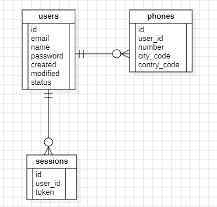

# User Registration API

This project is a Spring Boot application for user registration.



## Prerequisites

- Java 17 or higher
- Gradle
- IDE (e.g., IntelliJ IDEA)
- H2 Database (for development)

## Installation

1. Clone the repository:
    ```sh
    https://github.com/guzman890/SermalucBackend.git
    ```

2. Build the project:
    ```sh
    ./gradlew build
    ```

3. Run the application:
    ```sh
    ./gradlew bootRun
    ```

## Usage

### Access Swagger UI

1. Start the application.
2. Open a web browser and navigate to `http://localhost:8080/swagger-ui.html` to access the Swagger UI.

### API Endpoints

- `POST /auth/register` - Register a new user
- `POST /auth/login` - Login a user
- `GET /users` - Get all users
- `GET /users/{id}` - Get user by ID

## CURL Examples
```
curl --location 'http://localhost:8080/auth/register' \
--header 'Content-Type: application/json' \
--data-raw '{
   "name": "Juan Rodriguez",
   "email": "juan@rodriguez.org",
   "password": "hunter2",
   "phones": [
      {
         "number": "1234567",
         "citycode": "1",
         "contrycode": "57"
      }
   ]
}'
```
## Database Schema

The database schema is defined in the `backup.sql` file located in the `src/main/resources/migration.db` directory.

### `backup.sql`

```sql
CREATE TABLE users (
    id BIGINT AUTO_INCREMENT PRIMARY KEY,
    email VARCHAR(255) NOT NULL UNIQUE,
    name VARCHAR(255) NOT NULL UNIQUE,
    password VARCHAR(255) NOT NULL UNIQUE,
    created TIMESTAMP NOT NULL,
    modified TIMESTAMP NOT NULL,
    status VARCHAR(255)
);

CREATE TABLE phones (
    id BIGINT AUTO_INCREMENT PRIMARY KEY,
    user_id BIGINT NOT NULL,
    number VARCHAR(255) NOT NULL UNIQUE,
    city_code VARCHAR(255) NOT NULL UNIQUE,
    contry_code VARCHAR(255) NOT NULL UNIQUE,
    FOREIGN KEY (user_id) REFERENCES users(id)
);

CREATE TABLE sessions (
    id BIGINT AUTO_INCREMENT PRIMARY KEY,
    user_id BIGINT NOT NULL,
    token VARCHAR(255) NOT NULL,
    FOREIGN KEY (user_id) REFERENCES users(id)
);